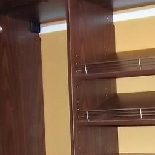
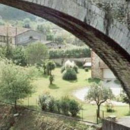
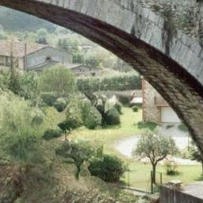
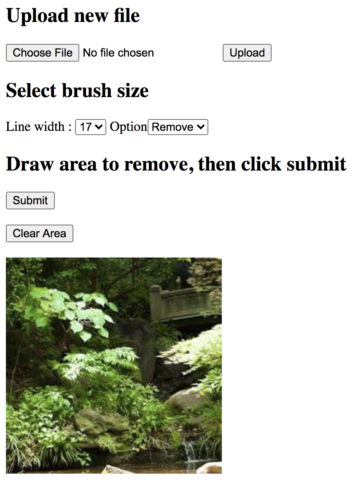

# crfill
code for paper ``Image Inpainting with Contextual Reconstruction Loss"

  	
  	
  	
  

## Usage
### Basic usage
1. Install dependencies:
```
conda env create -f environment.yml
```
or manually install these packages in a Python 3.6 enviroment: 

```pytorch=1.3.1```, ```opencv=3.4.2```, ```tqdm```


2. Use the code:

with GPU:
```
python test.py --image path/to/images --mask path/to/hole/masks --output path/to/save/results
```
without GPU:
```
python test.py --image path/to/images --mask path/to/hole/masks --output path/to/save/results --nogpu
```
```path/to/images``` is the path to the folder of input images; ```path/to/masks``` is the path to the folder of hole masks; ```path/to/save/results``` is where the results will be saved. 

Hole masks are grayscale images where pixel values> 0 indicates the pixel at the corresponding position is missing and will be replaced with generated new content. 

:mega: :mega: The white area of a hole mask should fully cover all pixels in the missing regions. :mega: :mega:

### Web APP

For your convinience of visualization and evaluation, I provide an inpainting APP where you can interact with the inpainting model in a browser, to open a photo and draw area to remove. To use the web app, these additional packages are required: 

```flask```, ```requests```, ```pillow```

Then execute the following:

With GPU:
```
cd app
python hello.py
```

Without GPU:
```
cd app
python hello.py --nogpu
```

After that, open http://localhost:2334 in the browser

### The adjusted model for high-res inpainitng
To use the adjusted model for high-res inpainting (specifiy the option ```--nogpu``` to run on cpu):
```
python test.py --opt nearestx2 --load ./files/model_near512.pth \
--image path/to/images \
--mask path/to/hole/masks \
--output path/to/save/results \
```

By default, the Web APP selects from the two models based on the image size. The adjusted model will be used if the short side >= 512. To mannualy specify the model used in the Web APP:
```
cd app
python hello.py --opt nearestx2 --load ./files/model_near512.pth
```
or
```
cd app
python hello.py --opt convnet --load ./files/model_256.pth
```

### Auxiliary network
The auxiliary network (used during training) is defined in networks/auxiliary.py. The full training code will be released after paper accepted. 


