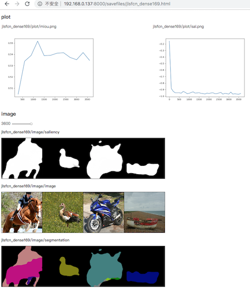

# Visualization tool
write curves and images to html files and host them using simple http server

## Usage
### Initialize:
```python
writer = Logger("path/to/save/files", clear=True)
## clear=True to delete existing files
```

``path/to/save" is an existing director. That Logger creates those folders and files:

```
path/to/save
-files.html
-files
--image
--image_ticks
--plot
```

It starts another thread that is a http server on 8000 port and in the executing path. So we can open that page files.html in a browser. e.g., http://localhost:8000/path/to/save/files.html

### Write scalar 
```python
writer.add_scalar("name", value, num_iter)
```
it creates a ```path/to/save/plot/name.png``` recording the ```value``` as ```num_iter``` changes. 

### Write image
```python
writer.add_image('name', tensor_image, num_iter)
## tensor_image is a pytorch Tensor of shape (3, H, W)
```

```python
img = input[:num_show] * v_std + v_mean # a bach of normalized input
writer.add_image('name', torchvision.utils.make_grid(img).detach(), num_iter)
```

it creates a ```path/to/save/image/name/{num_iter}.png``` and append that num_iter to txt file ```path/to/save/image_ticks/name.txt```

### Create html page
Having written everything to visualize, then update that html file
```
writer.write_html()
```
it overwrite path/to/save/files.html and include the latest scalars and images. 


